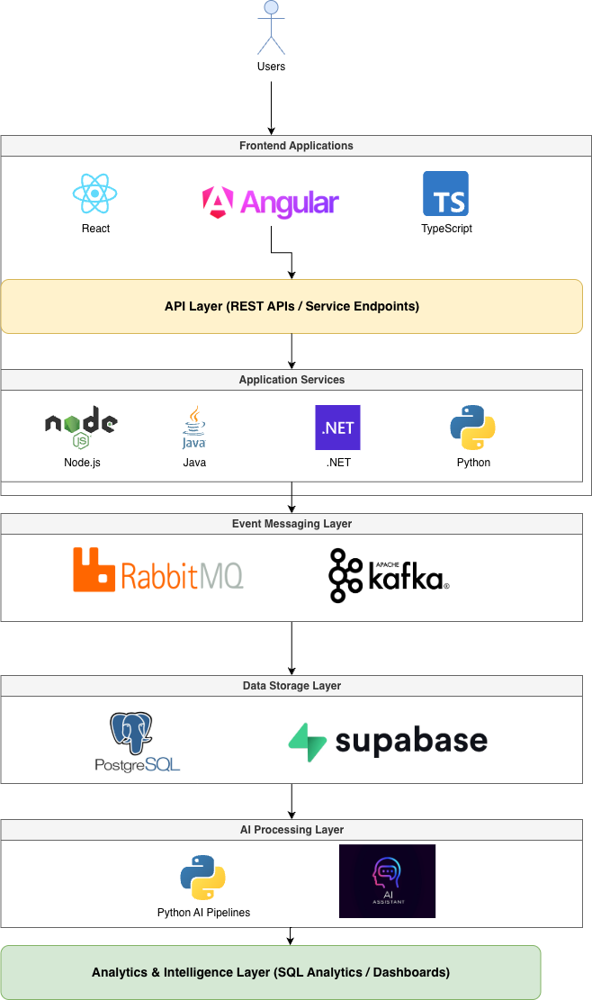

<h1 align="center">Molefe Sefatsa</h1>

Founder • Software Engineer • Platform Architect

Designing AI-powered SaaS platforms, distributed systems and procurement intelligence solutions.

---

# 👋 About Me

I am the founder of **The Hub ZA Technologies**, where I design and build enterprise-grade platforms focused on **procurement intelligence, data analytics, and AI-powered automation**.

My engineering work focuses on building **scalable SaaS platforms** that combine:

• distributed data ingestion pipelines  
• AI-powered document intelligence  
• enterprise backend systems  
• secure multi-tenant architectures  
• analytics-driven product platforms  

A key focus of my work is building systems that help businesses **discover, analyse and compete for government tenders more effectively**.

---

# 🚀 Platform: Track My Tenders

**Track My Tenders** is a procurement intelligence platform designed to help companies identify opportunities and make data-driven bidding decisions.

Key capabilities include:

• real-time tender discovery  
• AI-generated tender summaries  
• compliance requirement extraction  
• submission workflow management  
• historical tender award intelligence  
• procurement market analytics  

The platform operates as a **multi-tenant SaaS environment** where each organisation has its own isolated workspace and data environment.

---

# 🏗 Platform Architecture

Track My Tenders is designed using a **cloud-native SaaS architecture**.

  

Core architectural principles:

• multi-tenant data isolation  
• event-driven system design  
• distributed processing pipelines  
• scalable backend services  
• AI-driven data enrichment  

---

# 🧠 Procurement Intelligence Engine

A major component of the platform focuses on **market intelligence derived from procurement data**.

Data ingestion pipelines collect tender data from multiple procurement sources and transform it into structured insights.

Processing stages include:

- opportunity ingestion
- document parsing
- AI summarisation
- compliance extraction
- historical award analysis

These insights power:

• tender discovery feeds  
• opportunity recommendations  
• competitor intelligence  
• procurement market analytics  

---

# 🖥 Frontend Engineering

Modern frontend applications are built using:

React  
Angular  
TypeScript  
JavaScript  

Frameworks and UI ecosystems:

Next.js  
Vite  
TailwindCSS  
ShadCN UI  
Material UI  
Radix UI  

State management and data handling:

Redux Toolkit  
RTK Query  
TanStack React Query  
Zustand  

Frontend capabilities include:

- enterprise dashboards
- real-time analytics visualisation
- multi-tenant workspace interfaces
- document management systems
- AI-powered UI experiences

Libraries frequently used:

Recharts  
Chart.js  
Framer Motion  
React Hook Form  
Zod  

---

# 🛠 Backend Engineering

Backend systems are built using multiple technology stacks depending on system requirements.

Languages used:

Node.js  
Java  
C# .NET  
Python  

Frameworks:

Spring Boot  
ASP.NET Core  
Express  

Backend services handle:

- API development
- authentication systems
- business logic processing
- event-driven background services
- data processing pipelines

---

# 📡 Event Streaming & Messaging

Distributed application services communicate through event messaging systems.

Technologies used:

RabbitMQ  
Apache Kafka  

These platforms support:

- asynchronous processing
- distributed service communication
- event-driven workflows
- background job orchestration

---

# 🤖 AI & Document Intelligence

AI services are used to process procurement documents and extract actionable insights.

Capabilities include:

• AI-powered document summarisation  
• semantic document analysis  
• structured compliance extraction  
• automated opportunity classification  

These systems transform **raw tender documentation into structured data** used by the analytics engine.

---

# 🗄 Database Engineering & Administration

Data architecture is built around relational database systems designed for high integrity and analytics performance.

Technologies used:

PostgreSQL  
Supabase  

Database capabilities include:

- relational schema design
- query optimisation
- row-level security (RLS)
- audit logging
- analytics queries
- materialized views
- database migration management
- tenant-aware data models

---

# 🔐 Security Architecture

Security is built into the architecture from the foundation.

Security practices include:

• multi-tenant data isolation  
• row level security policies  
• secure authentication systems  
• API authentication and authorisation  
• encrypted service communication  
• audit logging for sensitive operations  

Security design principles:

- least privilege access control
- tenant data separation
- secure API design
- strong authentication models
- activity monitoring and audit trails

---

# ☁️ DevOps & Infrastructure

I design and manage the infrastructure required to operate SaaS platforms reliably.

DevOps capabilities include:

Docker containerisation  
CI/CD pipelines  
GitHub Actions  
cloud deployments  
environment configuration management  

Operational responsibilities include:

- platform deployment automation
- release management
- environment orchestration
- infrastructure monitoring

---

# 📊 Monitoring & Observability

Production systems are monitored to ensure reliability and operational visibility.

Monitoring tools include:

Prometheus  
Grafana  
Elastic Stack (ELK)  

These systems provide:

- application performance monitoring
- infrastructure metrics
- distributed system logging
- operational alerting

---

# 📈 GitHub Stats

---

# 🌍 Connect

Website  
https://www.hubzatech.com

---

⭐ Building platforms that help businesses compete smarter in the procurement economy.
